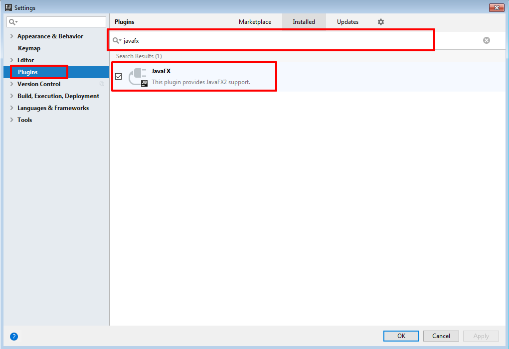
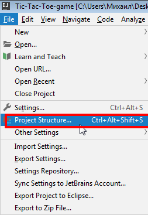
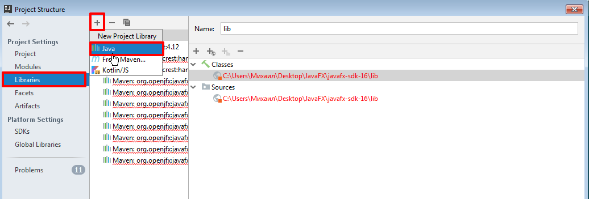
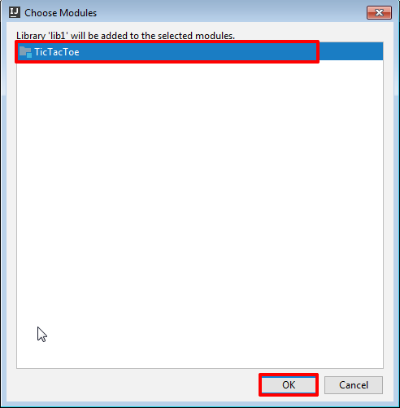
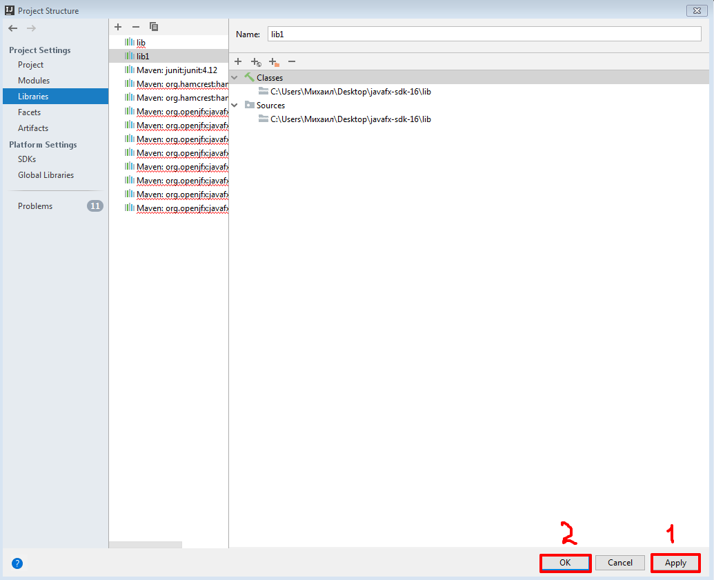

## Подключение JavaFX к проекту
*<b>JavaFX</b> - это программная платформа, используемая для разработки настольных приложений, которые могут работать на самых разных устройствах.*
*<p>Поддержка <b>JavaFX в IntelliJ IDEA</b> включает в себя завершение кода, поиск, навигацию и рефакторинг 
в специфичных для JavaFX исходных файлах (включая файлы. fxml и JavaFX .css), интеграцию с JavaFX Scene Builder, 
возможности упаковки приложений JavaFX и многое другое.</p>*
### Скачать JavaFX SDK
1. Загрузите пакет [JavaFX SDK](https://gluonhq.com/products/javafx/), подходящий для вашей операционной системы.
2. Распакуйте архив и поместите папку в значимое место, например: <b>/Users/jetbrains/Desktop/javafx-sdk-12</b>.
### Убедитесь, что плагин JavaFX включен
Чтобы иметь возможность работать с JavaFX в IntelliJ IDEA, необходимо включить встроенный плагин JavaFX:
1. В диалоговом окне <b>Settings/Preferences</b> (или ```Ctrl+Alt+S```) выберите пункт <b>Плагины (Plugins)</b>.
2. Перейдите на вкладку <b>Установлено (Installed)</b> и убедитесь, что плагин JavaFX включен. Если плагин отключен, установите флажок рядом с ним.
3. <p>Примените изменения и закройте диалоговое окно. При появлении соответствующего запроса перезапустите IDE.</p>

### Добавьте библиотеку JavaFX
*<p>Эти действия необходимы, если Вы используете Java 11 и более поздние версии.</p>*
1. В главном меню выберите пункт <b> Файл (File) | Структура проекта (Project Structure) </b> или (```Ctrl+Alt+Shift+S```).


<p>2. Откройте раздел <b>Библиотеки (Libraries)</b>, щелкните <b>Новая Библиотека Проекта (New Project Library)</b> и выберите Java. </p>


<p>3. Укажите путь к папке <b>lib</b> в пакете JavaFX SDK, например: <b>/Users/jetbrains/Desktop/javafx-sdk-12/lib</b>.</p>
<p>4. В диалоговом окне <b>Выбор модулей (Choose Modules)</b> выберите необходимый модуль и нажмите кнопку <b>ОК</b>. </p>


<p>5. Примените изменения и закройте диалоговое окно <b>Структура проекта (Project Structure)</b>. </p>


### Добавление параметров виртуальной машины
*Эти действия необходимы, если вы используете Java 11 и более поздние версии.*
1. В главном меню выберите пункт <b>Выполнить (Run) | Изменить конфигурации (Edit Configurations...)</b>.

 
