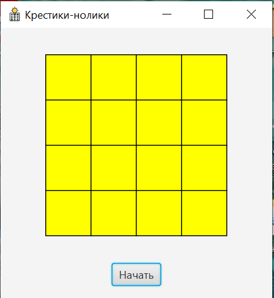
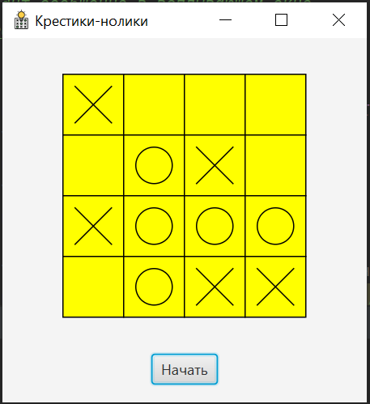
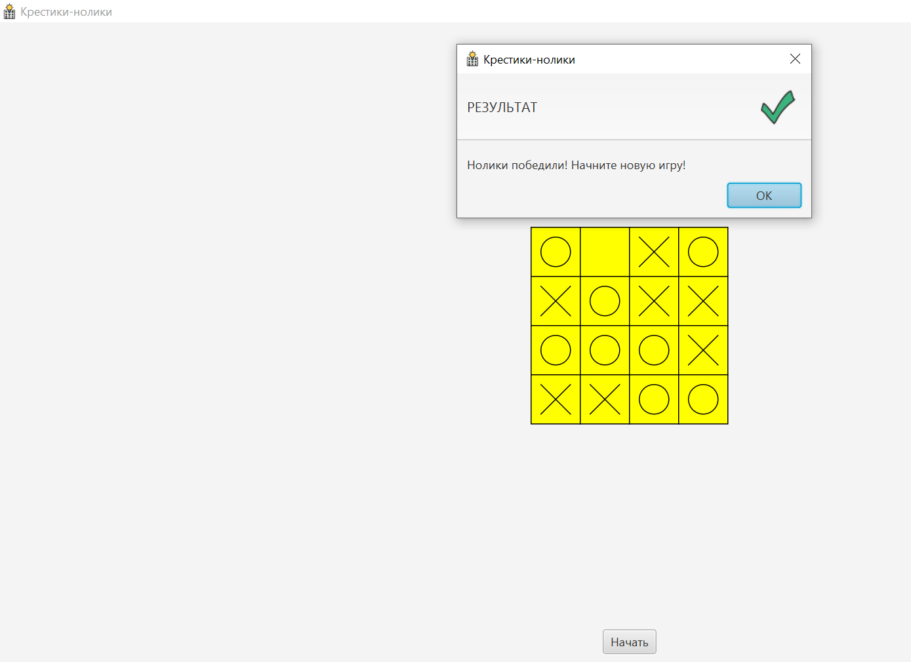
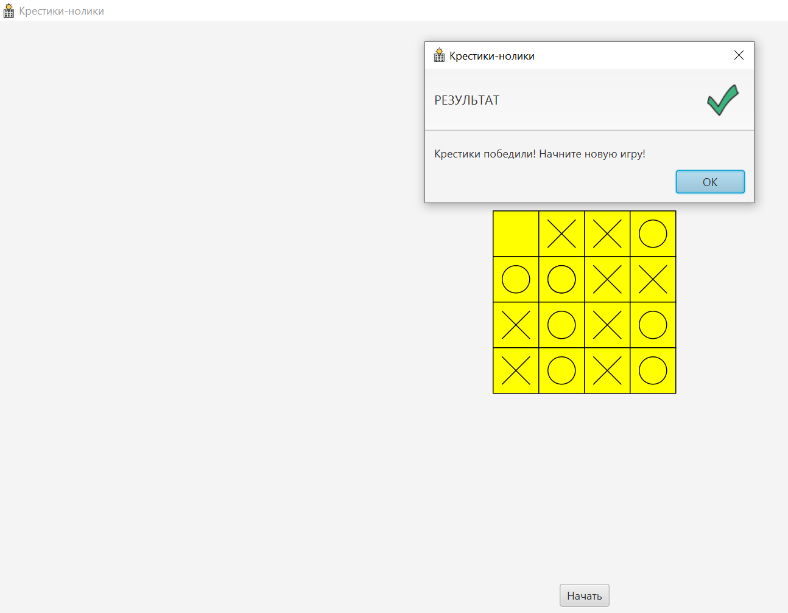
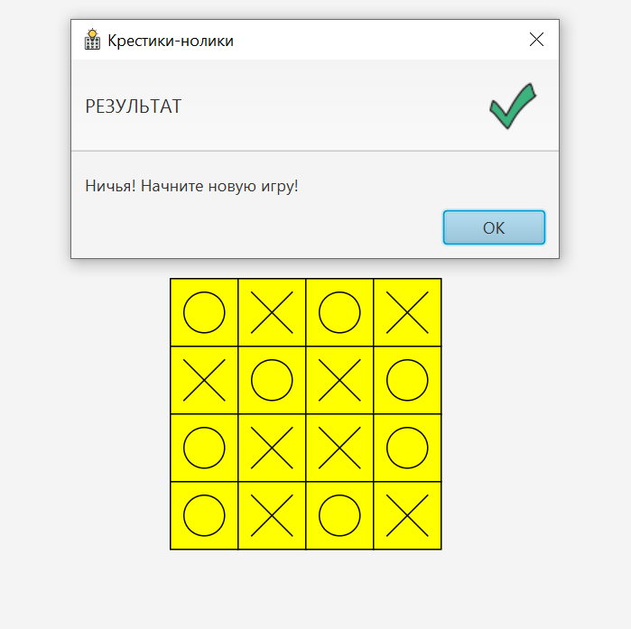
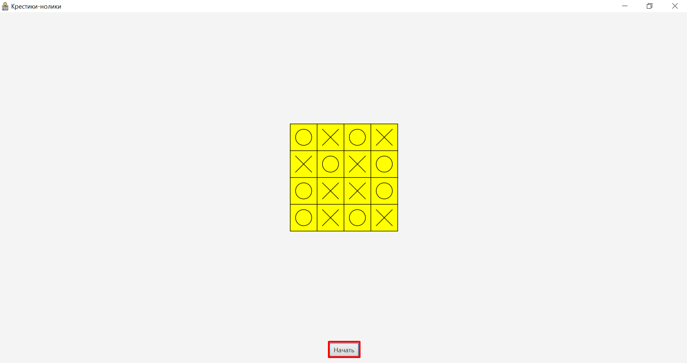
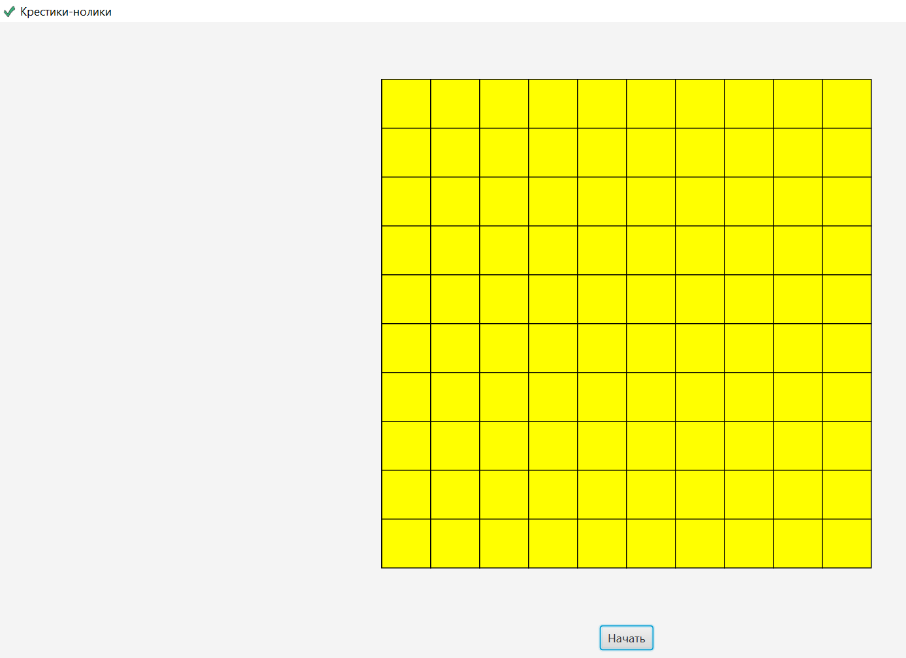

# Tic-Tac-Toe-game
Компьютерная игра "Крестики-нолики" (X и O). <br>
<b> Крестики-нолики </b> - логическая игра между двумя противниками на 
квадратном поле 3 на 3 клетки или большего размера (вплоть до "бесконечного поля"). Один из игроков играет "крестиками", второй - "ноликами". 
В традиционной китайской игре (<b>Гомоку</b>) используются чёрные и белые камни. <br/>
## Разработчики <br/>
* Горбатенков Михаил
* Новосельцева Евгения ([Контактные данные](https://vk.com/devochka_voyina))
* Паршикова Екатерина ([Контактные данные](https://vk.com/id181345090))
## Правила 
*Игроки по очереди ставят на свободные клетки поля 3х3 знаки (один всегда крестики, другой всегда нолики). Первый, выстроивший в ряд 3 своих фигуры по вертикали, горизонтали или диагонали, выигрывает. Первый ход делает игрок, ставящий крестики.*
## Библиотека JavaFX
*Компьютерная игра "Крестики-нолики" была реализована при помощи библиотеки JavaFX. 
Подключение библиотеки JavaFX к проекту продемонстрировано в файле [JavaFX_project.md](JavaFX_project.md).*
## Описание компьютерной игры 
*Игра «Крестики-нолики» реализована с применением объектно-ориентированного программирования. В приложении учтены все моменты, позволяющие пользователю легко освоить программу, для этого был создан удобный интерфейс, который является «визитной карточкой» компьютерной игры. Ниже, продемонстрированы скриншоты, демонстрирующие работу приложения.*
#### Главная страница приложения </br>

#### Игровой процесс

#### Победа "ноликов" (О) в компьютерной игре

#### Победа "крестиков" (X) в компьютерной игре

#### Ничья в компьютерной игре 
*<p>Часто возникают ситуации, когда <b>ни «нолики», ни «крестики»</b>, не смогли победить. Ничья в компьютерной игре «Крестики-нолики» показана на рисунке ниже.</p>*

#### Новая игра
*<p>Чтобы начать новую игру, необходимо нажать на <b>кнопку «Начать»</b>. Данная кнопка расположена под игровым полем.</p>*

#### Размер игрового поля
*<p>Настроим игровое поле, имеющее размеры 10х10. Чтобы изменить размер поля, необходимо внести коррективы в программный код.</p>*
```java
 // Определяем размер игрового поля
    private final int size = 10;
```

## Заключение
*<p>Игра «Крестики-нолики» является полноценным программным продуктом, готовым для использования. Она обладает доступным, понятным и наглядным для пользователя интерфейсом.</p>*


